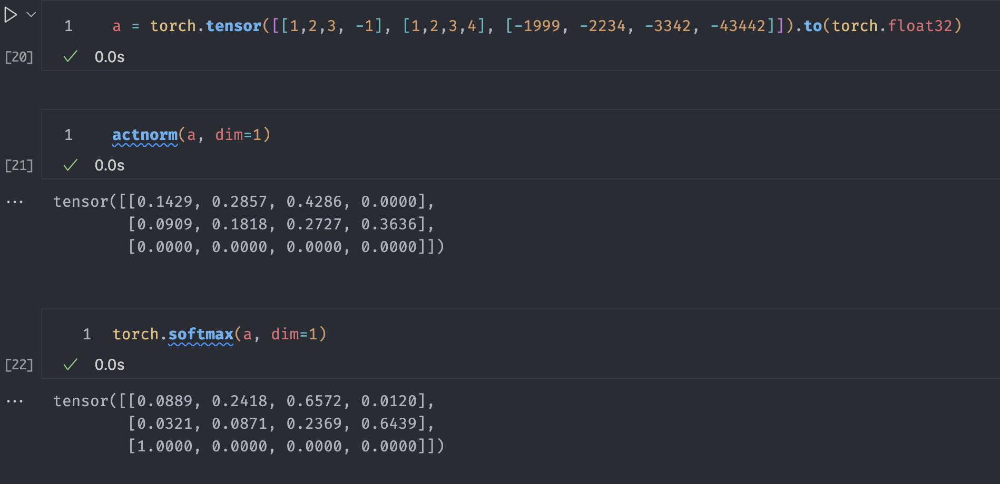

# Activation Normalization

Convert values into [0.0, 1.0] and that roughly looks like a probability distribution.

Takes an activation of the values, then converts into rough probabilities. Like Softmax, but faster and can get all 0s very easily. This is a drop in replcement for softmax in attention.

Above shows that for really negative values, while softmax chooses a value as 1.0 and the rest as 0.0, with a relu actnorm, all the values completely zero out.

You can try out other activation functions by changing the `activation=` keyword argument in the `actnorm` function.
